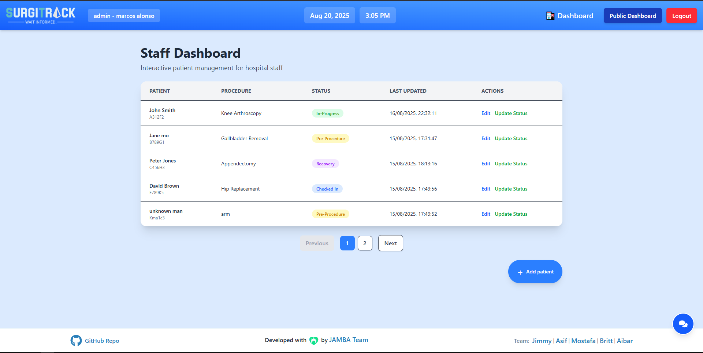
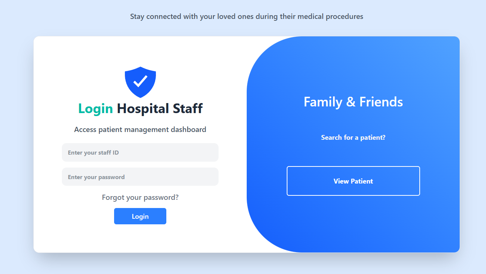
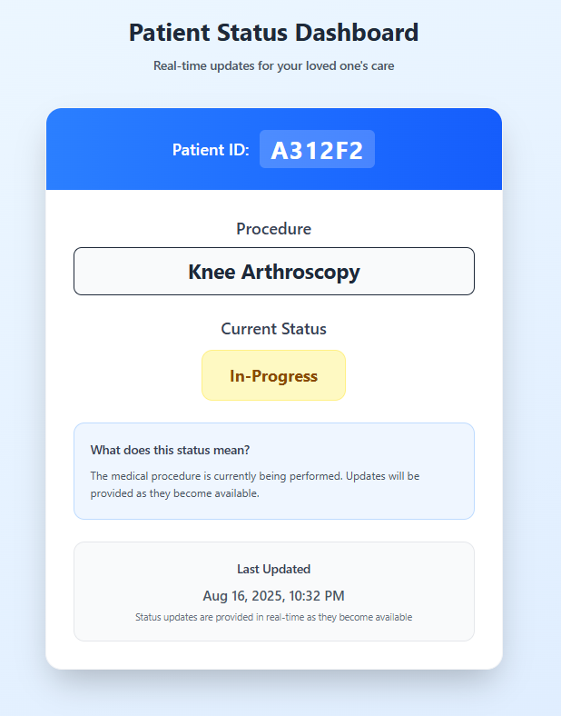

# SurgiTrack 🏥

*Real-Time Surgical Status Tracking System*

## Overview

SurgiTrack is a comprehensive patient status tracking system designed to reduce anxiety for families waiting during medical procedures. Originally scoped as a simple waiting room board, our team delivered a production-ready application with full authentication, role-based access, and a responsive design.

**The Problem:** Families often spend hours in hospital waiting rooms with little to no information on their loved ones' surgical progress, leading to heightened stress and anxiety.

**Our Solution:** SurgiTrack provides a real-time status tracking system with a secure patient lookup for families, a comprehensive dashboard for staff, and instant updates displayed on public monitors in waiting rooms.

## 🎥 Demo

[**SurgiTrack**](https://your-demo-link.com)

| Staff Dashboard | Staff Login | Patient Status |
| :---: | :---: | :---: |
|  |  |  |


## ✨ Features

### Core Features

  - 📺 **Public Waiting Room Display** - An auto-rotating patient status board designed for public waiting areas.
  - 🔍 **Patient Status Lookup** - A secure, ID-based search for patients.
  - 👨‍⚕️ **Staff Dashboard** - A complete patient management system for hospital staff.
  - 📱 **Responsive Design** - Optimized for tablets, phones, and large displays.

### Advanced Features

  * 🔐 **Multi-Role Authentication** - Differentiated access levels for Admin, Surgical Staff, and Guests to ensure data security.
  * 🎨 **Modern UI/UX** - A professional, healthcare-grade interface for an intuitive user experience.
  * 🤖 **AI Assistant Integration** - A Gemini-powered help system to assist users with application and policy questions.
  * 🏥 **Complete CRUD Operations** - Full capabilities for admins to Create, Read, Update, and Delete patient records.
  * 🔒 **Privacy-First Design** - Patient information is protected through secure, unique ID-based lookups.

## 🛠️ Tech Stack

| Technology       | Purpose                        |
| ---------------- | ------------------------------ |
| **React 19** | Frontend framework             |
| **Tailwind CSS** | Styling & responsive design    |
| **React Router** | Client-side routing            |
| **Context API** | State management               |
| **Gemini AI** | Chatbot integration            |
| **Vite** | Build tool & dev server        |

---
## 🎨 UI/UX & Responsive Design  

- **Clean & Professional Interface**  
  The application uses a healthcare-grade design system with a consistent color palette, typography, and spacing to ensure a simple and professional user experience.  

### 📱 Guests (Responsive Pages on Smartphones)  
Guest-facing pages are **mobile-first** and fully responsive:  

| Screen Size          | Layout                           |
|-----------------------|----------------------------------|
| Desktop (≥ 1024px)   | Four-column grid                 |
| Large Screens (≥ 2000px) | Six-column grid (e.g., waiting rooms) |

- **Login & Patient Search:** Simplified single-column for quick mobile access.  
- **Public Dashboard:** Auto-adjusts layout based on device size.  

### 💻 Staff (Desktop Only)  
- Optimized for **PC use** or **desktop mode in mobile browsers**.  
- Provides a **detailed table view** with:  
  - Full patient details  
  - Pagination  
  - Management tools  
- Not designed for mobile, ensuring staff work efficiently in a larger workspace.  

## 🚀 Quick Start

### Prerequisites

  - Node.js 16+
  - npm or yarn

### Installation

1.  **Clone the repository**

    ```bash
    git clone https://github.com/chingu-voyages/v56-tier1-team-03.git
    cd v56-tier1-team-03
    ```

2.  **Install dependencies**

    ```bash
    npm install
    ```

3.  **Start development server**

    ```bash
    npm run dev
    ```

## 💻 Usage

### For Admins

1.  Log in with Admin credentials.
2.  Access the Staff Dashboard to view all active patients.
3.  **Add new patients** and **edit existing patient information**.
4.  Update patient statuses throughout their entire journey.

### For Surgical Staff

1.  Log in with Surgical Staff credentials.
2.  Access the Staff Dashboard for an overview of patient statuses.
3.  **Update patient status** using a streamlined interface as they move through surgical stages.

### For Families & Visitors

1.  Navigate to the patient lookup page.
2.  Enter the unique 6-character patient ID.
3.  View the patient's real-time surgical status and get clear explanations for each stage.

### Sample Credentials

  * **Admin:** `identityNumber: 1` | `password: adminpass`
  * **Surgical Staff:** `identityNumber: 3` | `password: surgical123`
  * **Patient ID:** `A312F2`

## 📂 Project Structure

```
src/
├── components/          # Reusable UI components
│   ├── Layout/         # Header, Footer
│   └── UI/             # Chatbot, Icons
├── contexts/           # State management (Auth, Patients)
├── data/               # Mock data
├── Pages/              # Page components
│   └── admin/          # Admin-specific pages
├── services/           # API integration (Gemini)
├── App.jsx             # Main component with routing
├── main.jsx            # Application entry point
└── index.css           # Global styles
```

## 🎯 User Flows

### Admin Workflow

`Login → Dashboard → Add/Edit Patient Info → Update Status → Confirm`

### Surgical Staff Workflow

`Login → Dashboard → Select Patient → Update Status → Confirm`

### Family & Guest Workflow

`Enter Patient ID → View Status → Get Updates`

## 🏆 The Team

This project was brought to life by **JAMBA Team** as part of Chingu Voyage 56.


## 🔮 Future Enhancements  

#### 🛠 Technical Features  
- [ ] **Full-Stack Implementation:** Add backend + database instead of mock data.  
- [ ] **Real-Time Updates:** Use WebSockets instead of auto-refresh.  
- [ ] **Hospital Authentication:** Connect with Active Directory / LDAP.  
- [ ] **EHR Integration:** Sync with hospital’s main health record system.  
- [ ] **Internationalization (i18n):** Multi-language support.  

#### 📋 Planned Features  
- [ ] **Staff Notifications:** Automatic alerts when patient status changes.  
- [ ] **Patient History & Audit Logs:** Track status changes with timestamps and staff info.  
- [ ] **Admin Analytics Dashboard:** Metrics on procedure times, recovery, and efficiency.  


## 🤝 Contributing  

We welcome contributions to help improve **SurgiTrack**!  
If you'd like to contribute, please follow these steps:  

1. **Fork** the repository to create your own copy.  
2. **Create a new branch** for your changes (e.g., `feature/new-button` or `fix/login-error`).  
3. **Make your changes** and commit them with a clear, descriptive message.  
4. **Push** your branch to your forked repository.  
5. **Open a Pull Request** to the `main` branch of the original repository, and we'll review it.  

## Acknowledgments

A special thank you to **Chingu** for providing the collaborative platform and opportunity that made this project possible. This project is a testament to the power of teamwork and learning in a supportive environment. We'd also like to thank the open-source community for creating the amazing tools and libraries that powered our development.

-----

**Made with ❤️ for families waiting in hospital rooms everywhere.**

⭐ Star this repo if you found it helpful\!
